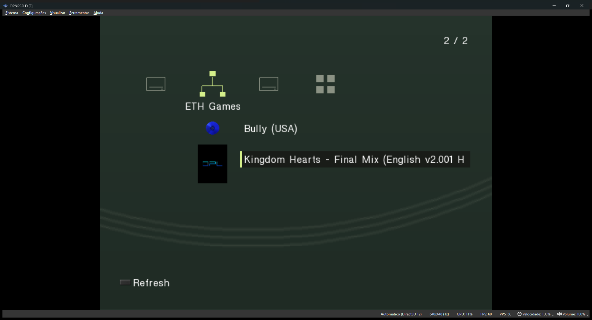
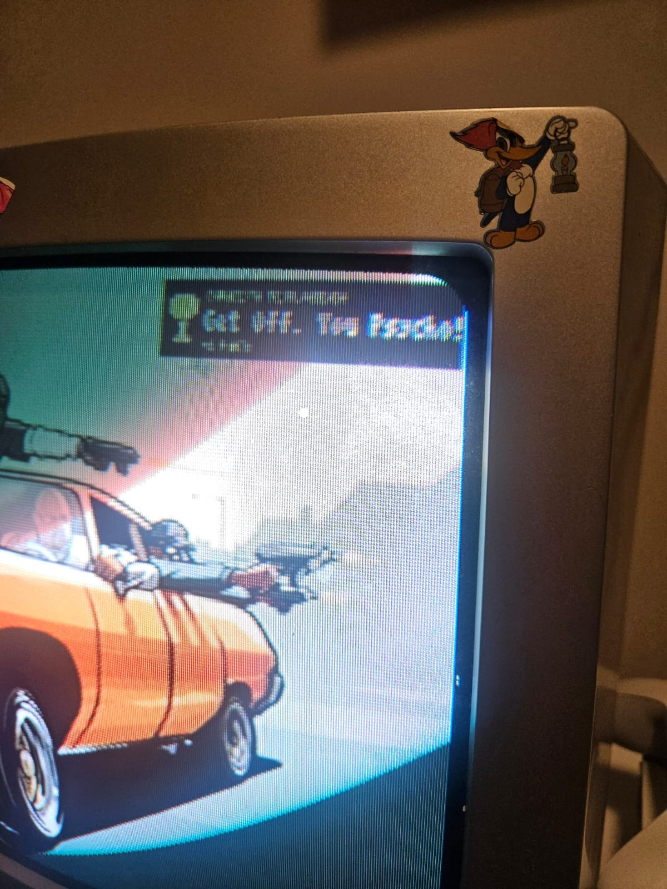
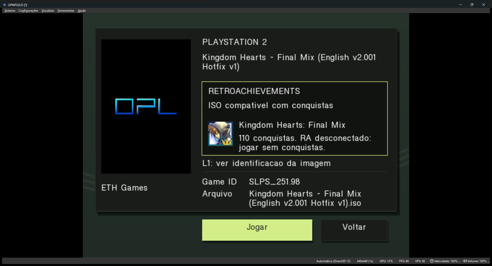
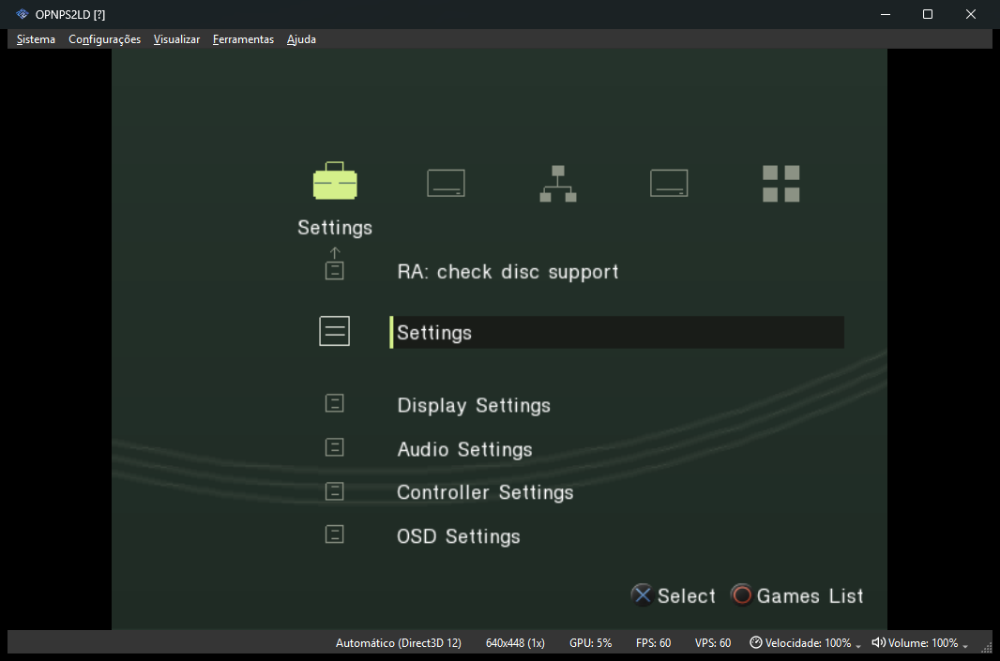

# Caduceus OPL

Uma versão do **Open PS2 Loader para PlayStation 2** com interface inspirada no XMB, navegação por categorias e integração com o [Caduceus](https://github.com/Rian6/caduceus).

**Esta versão depende do servidor Caduceus para os recursos integrados de rede, capas e RetroAchievements.** O OPL roda no PS2, enquanto o Caduceus roda no computador e fornece os serviços usados pelo console.



## Recursos

- Interface XMB para jogos, aplicativos e configurações.
- Acesso a jogos por USB/BDM, HDD e rede.
- Capas e tela de detalhes com informações do jogo.
- Consulta de compatibilidade com RetroAchievements pelo Caduceus.
- Categoria **Conquistas**, com jogos da conta, progresso e filtros de conquistas desbloqueadas, pendentes e hardcore.
- Inicialização de jogos com ou sem conquistas, conforme a disponibilidade da integração.

## Conquistas diretamente no PS2

**Agora é possível visualizar as conquistas diretamente na tela do PlayStation 2 enquanto o jogo está rodando.**

Ao desbloquear uma conquista, um card aparece no canto superior direito com o nome da conquista e os pontos recebidos. As notificações são enviadas automaticamente pelo Caduceus, integrado ao RetroAchievements, para você acompanhar os desbloqueios sem sair da partida ou olhar para o computador.

<p align="center">
  
</p>

*Card de conquistas exibido em um PS2 físico.*

O card conectado é um recurso experimental e ainda está em validação no console físico.

## Interface

### Detalhes do jogo

Confira a capa, as informações do jogo e a compatibilidade com RetroAchievements antes de iniciar a partida.



### Configurações



As imagens foram capturadas no PCSX2. O projeto está em desenvolvimento e ainda requer validação contínua no PS2 físico.

## Download

Snapshot de 2026-10-06:

- [Baixar OPL-RA.ELF](https://github.com/Rian6/caduceus-opl/releases/download/v0.1.1-snapshot.20261006/OPL-RA.ELF)
- [Página da release](https://github.com/Rian6/caduceus-opl/releases/tag/v0.1.1-snapshot.20261006)

## Primeiros passos

1. Instale e configure o servidor conforme as instruções do [Caduceus](https://github.com/Rian6/caduceus).
2. Execute `OPL-RA.ELF` no PS2 (ou `OPNPS2LD.ELF` se compilou localmente).
3. Nas configurações de rede do OPL, informe o endereço e a porta do servidor. O compartilhamento padrão é **PS2**, em maiúsculas.
4. Acesse a biblioteca, selecione um jogo e abra seus detalhes para jogar.

Mantenha o Caduceus em execução e acessível ao PS2 para usar os recursos integrados. Jogos em dispositivos locais podem ser iniciados sem conquistas quando o servidor estiver indisponível. Jogos pela rede precisam do compartilhamento ativo.

### Controles principais

| Controle | Ação |
| --- | --- |
| Esquerda / direita | Alternar categorias ou opções na tela de detalhes |
| Cima / baixo | Navegar pela lista |
| Confirmar ou triângulo | Abrir os detalhes de um jogo na biblioteca |
| Select | Atualizar a biblioteca ou repetir a consulta RA nos detalhes |
| Start | Abrir configurações na biblioteca |
| Quadrado | Abrir opções do jogo |
| Cancelar | Voltar dos detalhes para a biblioteca |

Os botões de confirmar e cancelar seguem a configuração de X/círculo do OPL.

## RetroAchievements

O Caduceus verifica a compatibilidade da imagem do jogo e informa o estado da sessão RA. A opção **Jogar** fica disponível após a consulta, mesmo quando não há conquistas compatíveis ou a sessão está desconectada.

O reconhecimento de um jogo no catálogo não garante conquistas ativas: também são necessários uma sessão autenticada no servidor e os dados de monitoramento usados durante o jogo. A consulta de compatibilidade do card está disponível para ISOs em USB/BDM e ETH.

Para consultar seu progresso, entre na categoria **Conquistas** e confirme **Visualizar conquistas**. Também é possível acessar as conquistas de um jogo compatível diretamente pelos seus detalhes. Use **L1/R1** para trocar de página, **quadrado** para alternar os filtros e **Select** para atualizar. A lista mostra ícones, pontos, descrições e datas dos desbloqueios disponíveis na conta. Ao voltar da biblioteca, o OPL retorna ao submenu.

O Caduceus mantém as credenciais RA no computador. O pareamento com o OPL usa uma chave própria em `ART/CADUCEUS.KEY`, criada pelo servidor e lida pelo compartilhamento ETH. O compartilhamento deve estar ativo para acessar essa aba, mesmo ao consultar um jogo de USB. A chave deve permanecer no compartilhamento privado do PS2; não a publique no repositório. A consulta usa UDP **18198**.

## Compilação

Requer Linux ou WSL com **PS2DEV**, **PS2SDK** e **gsKit** instalados. Na raiz do repositório:

```sh
git submodule update --init --recursive
export PS2DEV=/caminho/para/ps2dev
bash tools/build/build-xmb.sh --achievements
```

O executável será gerado em `opl/OPNPS2LD.ELF`, com o log em `opl/xmb-build.log`.

Para compilar sem o card, execute o script sem argumentos. `--static-card` gera apenas a demonstração permanente.

## Desenvolvimento

| Diretório | Conteúdo |
| --- | --- |
| `opl/` | Código e recursos do console |
| `integrations/caduceus/` | Integração com o servidor |
| `tools/` | Compilação e ferramentas do emulador |
| `tests/` | Testes locais e de integração |
| `docs/` | Documentação técnica e imagens |

Para executar os testes locais, use Python 3 e GCC em Linux/WSL:

```sh
python3 tests/run-host.py
```

Consulte a documentação para os detalhes de desenvolvimento:

- [Interface e configuração](docs/OPL-XMB.md)
- [Integração com o Caduceus](integrations/caduceus/README.md)
- [Protocolos de comunicação](docs/protocol/PROTOCOL.md)
- [Testes](tests/README.md)

## Ajude a manter o projeto
PIX: ab3d2638-1bf7-4b16-b061-df7684195577

## Créditos e licença

Baseado no Open PS2 Loader e no fork com integração RA mantido por hacan359. Consulte a [licença](opl/LICENSE) e os [créditos](opl/CREDITS) do OPL.

## Dados privados

Credenciais, chaves de pareamento, ISOs, perfis de emulador e caches ficam fora do Git. Configure suas contas e enderecos localmente. As releases incluem somente o executavel e seus checksums; nao incluem jogos ou dados desta maquina.
